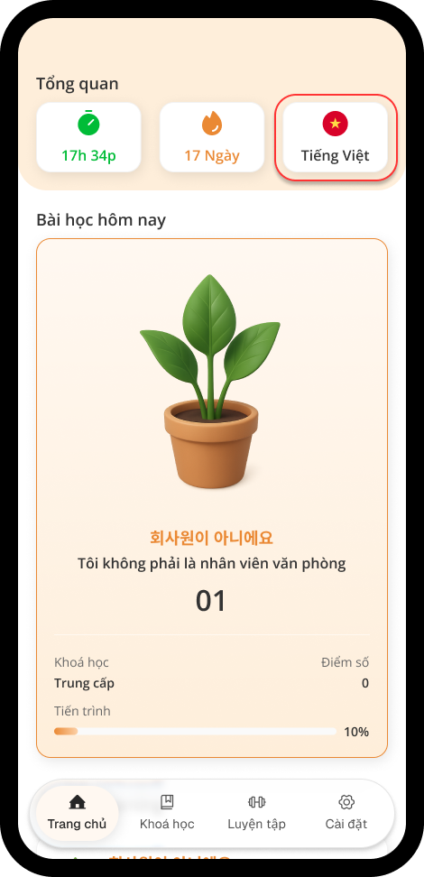
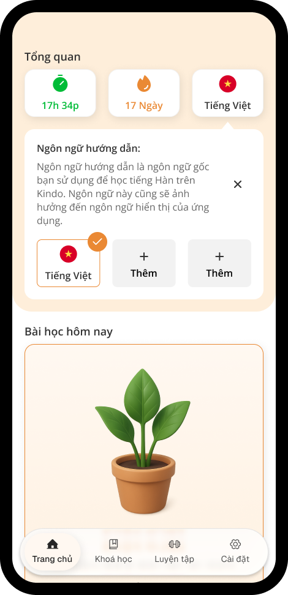
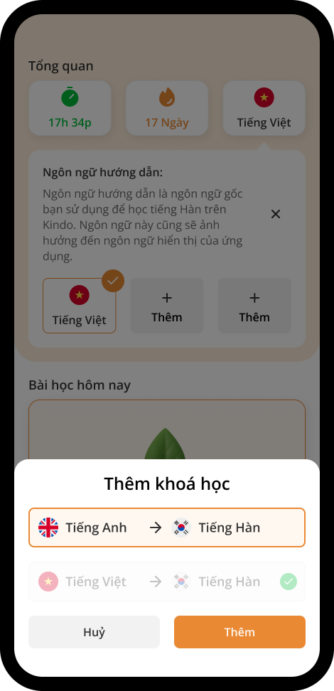
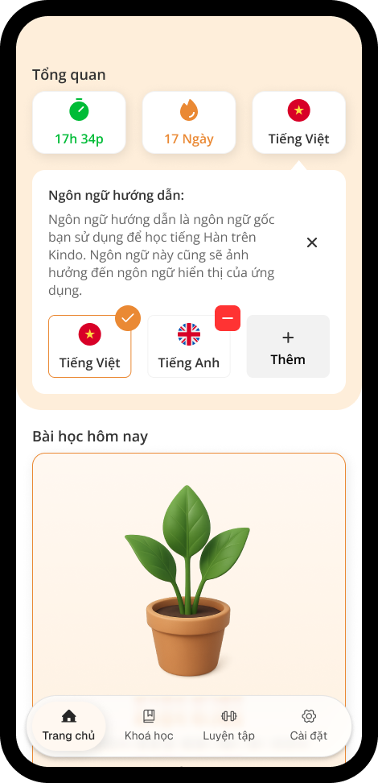

# Ngôn ngữ của khóa học

Với Kindo, bạn có thể học tiếng Hàn từ chính ngôn ngữ mẹ đẻ của mình, dù là tiếng Anh hay tiếng Việt. Ứng dụng cho phép bạn dễ dàng chuyển đổi giữa các ngôn ngữ trong quá trình học.

## Thêm ngôn ngữ khóa học mới

Sau khi đăng nhập, tại tab **Trang chủ**, nhấn nút **Quốc kỳ** – nút thứ 3 trong mục **Tổng quan**.

Một phần mới sẽ mở ra, sau đó nhấn nút **+ Thêm**.

Một cửa sổ sẽ trượt vào, hãy chọn ngôn ngữ khóa học mà bạn muốn thêm, sau khi hoàn tất, nhấn nút **Thêm**.

Hoàn tất! Bạn đã thêm thành công ngôn ngữ cho khóa học.

## Thay đổi & Xóa ngôn ngữ khóa học

Để thay đổi / xóa ngôn ngữ của một khóa học, nhấn nút **Quốc kỳ** – nút thứ 3 trong mục **Overall**.

Sau đó nhấn nút **Ngôn ngữ khóa học** mà bạn muốn thay đổi. Hoặc nhấn nút **Dấu trừ màu đỏ (-)** để xóa bất kỳ khóa học nào đang không được chọn.

**\*LƯU Ý:** Quá trình học của bạn sẽ **không được đồng bộ** giữa các ngôn ngữ khóa học.
