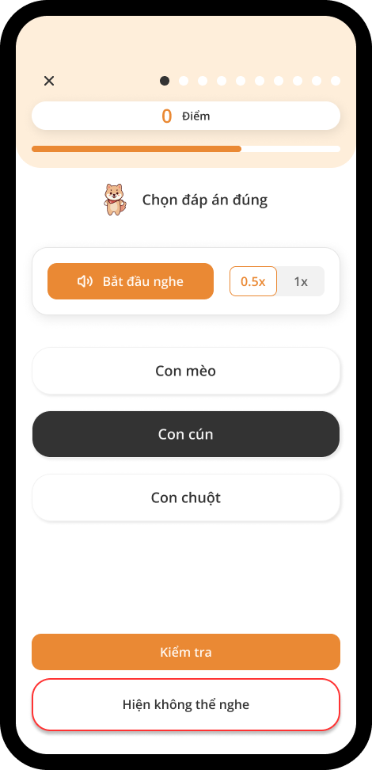
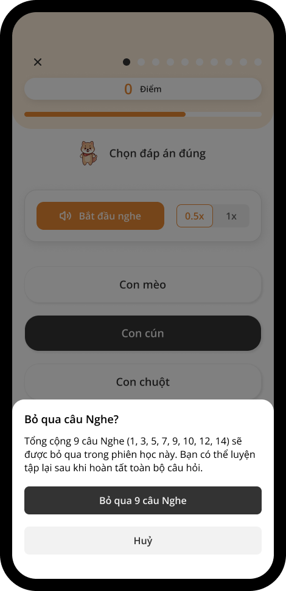
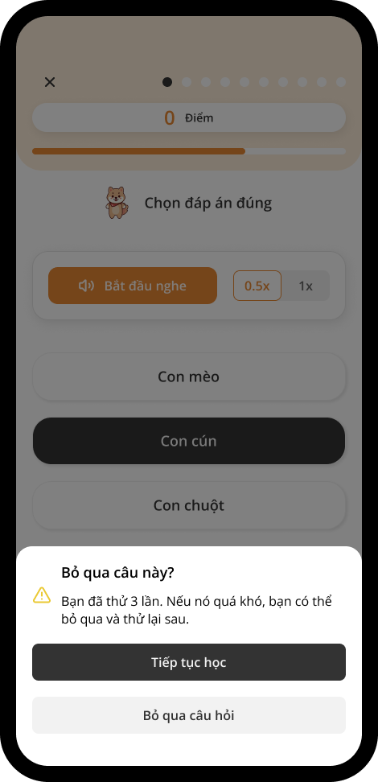

# Bỏ qua Câu hỏi

Nếu bạn không thể hoàn thành một câu hỏi nghe hoặc nói do hoàn cảnh khó khăn, hoặc đơn giản thấy câu hỏi quá thử thách, bạn có thể chọn bỏ qua nó.

## Bỏ qua Câu Nghe & Nói

Bạn có thể nhấn nút **Hiện không thể nghe** (đối với Câu hỏi Nghe) hoặc **Hiện không thể nói** (đối với Câu hỏi Nói) để bỏ qua **tất cả các câu Nghe / Nói** trong phiên học này.

Bạn có thể thử lại sau khi đã hoàn thành tất cả các câu hỏi khác.

## Bỏ qua một Câu Nói khó

Với mỗi câu Nói, bạn có tối đa 3 lần thử để hoàn thành. Nếu vẫn không được, bạn có thể bỏ qua bất kỳ câu Nói khó nào, và chỉ **câu hỏi đó** sẽ được bỏ qua.

