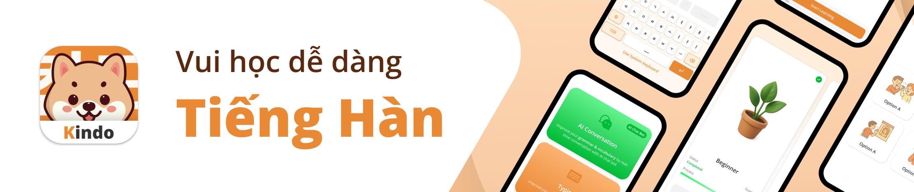

# Kindo là gì

**Kindo** là một ứng dụng di động được thiết kế để giúp người dùng học tiếng Hàn thông qua các bài học sinh động và gamified (trò chơi hóa).

Điểm khác biệt của chúng tôi trên thị trường:

- **Bàn phím ảo đầu tiên:** Chúng tôi là ứng dụng đầu tiên tích hợp sẵn bàn phím tiếng Hàn, mang đến trải nghiệm liền mạch để người dùng luyện viết.
- **Tích hợp A.I.:** Việc ứng dụng A.I. giúp cá nhân hóa thực hành hội thoại và thích ứng với từng trình độ của người dùng, nâng cao trải nghiệm học tập.

Các tính năng chính của Kindo:

- **Học tập gamified:** Kindo biến việc học ngôn ngữ thành trải nghiệm hấp dẫn với các định dạng hỏi – đáp tương tác, cho phép người học linh hoạt tập trung vào chủ đề mình quan tâm.
- **Hỗ trợ song ngữ:** Với hỗ trợ cả tiếng Anh và tiếng Việt, Kindo cho phép người dùng dễ dàng chuyển đổi ngôn ngữ, tiếp cận nhiều đối tượng hơn.
- **Thư viện bài học phong phú:** Nền tảng cung cấp hơn 150 bài học (đang được cập nhật), chia thành ba cấp độ riêng biệt, mỗi cấp khoảng 50 bài. Chương trình học có cấu trúc này được thiết kế để giúp người học đạt đến sự thông thạo.
- **Luyện tập với A.I.:** Hệ thống A.I. cung cấp các buổi luyện tập cá nhân hóa bao gồm đủ bốn kỹ năng: nghe, đọc, viết, và nói. Mỗi buổi đều có phần đánh giá chi tiết để định hướng cải thiện.
- **Chương trình khích lệ:** Người học được thúc đẩy thông qua hệ thống huy hiệu bắt mắt. Các huy hiệu này có thể sưu tầm và chia sẻ với bạn bè, tạo cảm giác thành tựu và cộng đồng.
