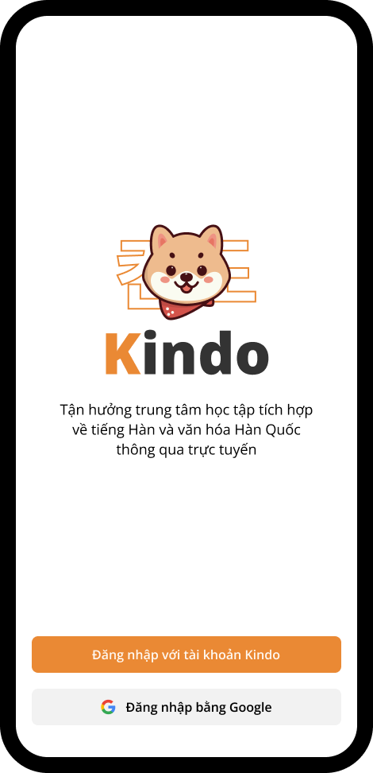
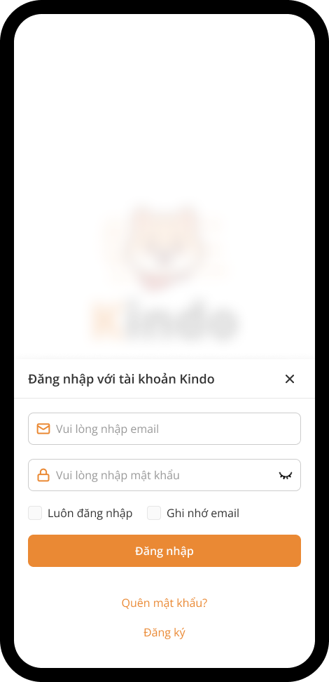
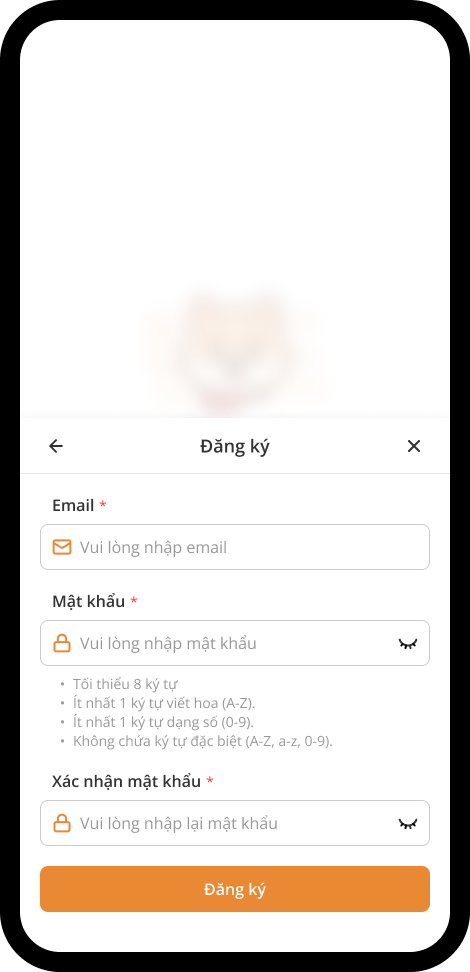
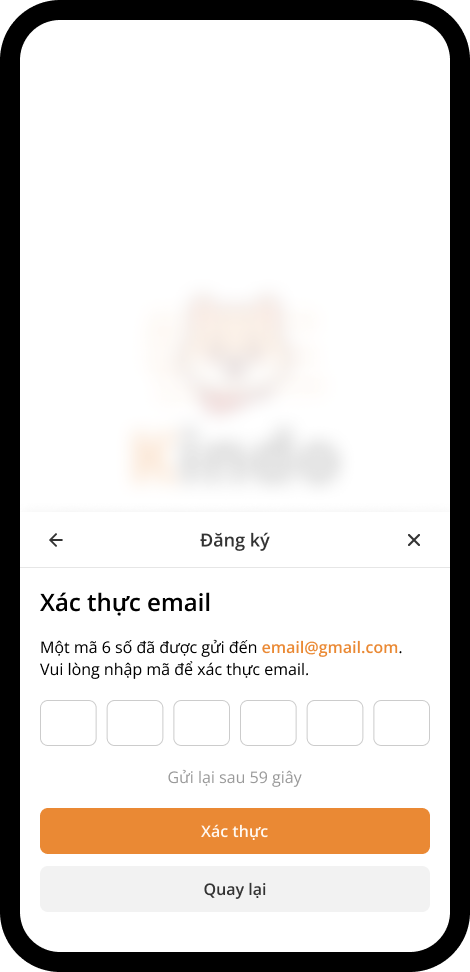
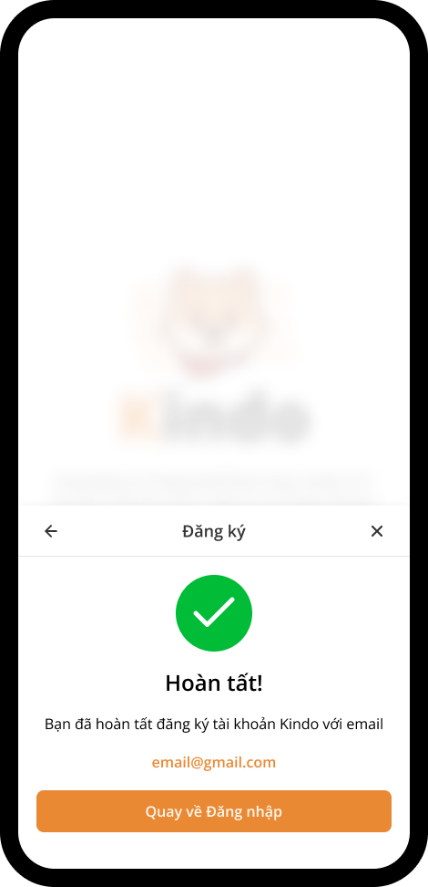

# Đăng nhập

Bạn có thể đăng nhập vào Kindo bằng tài khoản đã đăng ký hoặc đăng nhập bằng tài khoản Google. Nếu chưa có tài khoản Kindo, bạn có thể tạo một tài khoản mới.

## Tạo tài khoản mới

Trong màn hình đăng nhập, nhấn **Đăng nhập bằng tài khoản Kindo**.

Một cửa sổ sẽ mở ra, sau đó nhấn **Đăng ký**.

Điền đầy đủ thông tin vào các trường để tạo tài khoản. Sau khi hoàn tất, nhấn **Đăng ký**.

Một mã OTP sẽ được gửi đến địa chỉ email mà bạn đã đăng ký. Hãy kiểm tra hộp thư đến để lấy mã. Nếu không nhận được, vui lòng kiểm tra thêm trong mục spam hoặc thư rác. Sau khi có mã OTP, nhập vào và nhấn **Xác minh**.

Hoàn tất! Bạn đã đăng ký thành công tài khoản Kindo. Giờ đây, bạn có thể đăng nhập bằng tài khoản này.

## Đăng nhập bằng tài khoản Google

Bạn có thể sử dụng tài khoản Google của mình để đăng nhập nhanh chóng và đơn giản vào Kindo.
