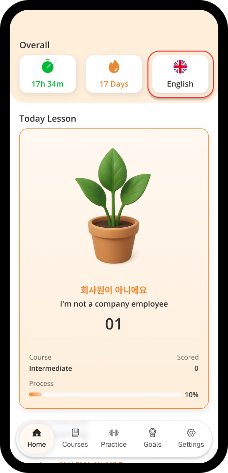
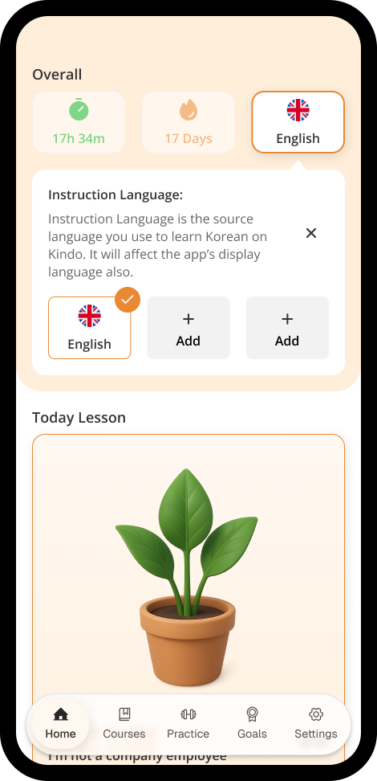
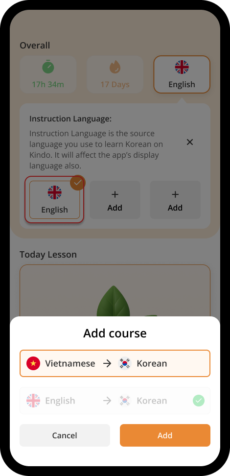
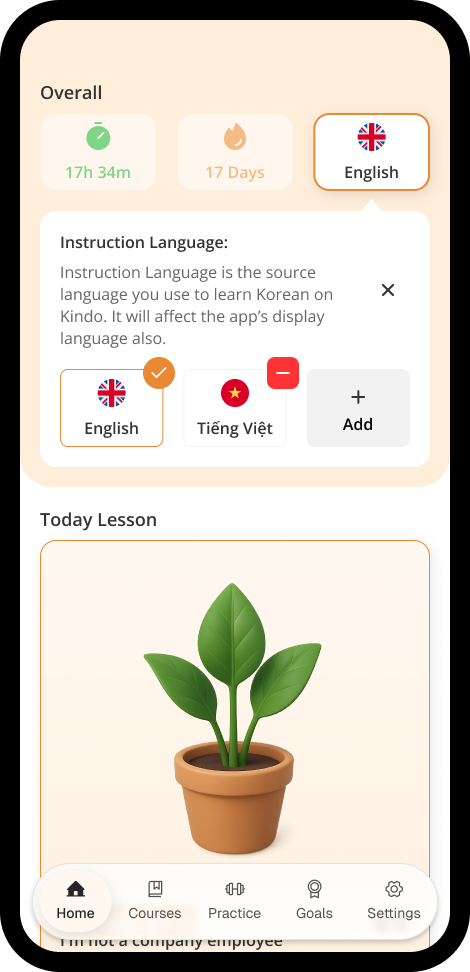

# Course's language

With Kindo, you can learn Korean from the comfort of your native language, whether it's English or Vietnamese. Our app makes it simple to switch between them as you study.

## Add new course's language

After signed in, in **Home** tab, click the **Country Flag** button - which the 3rd button in **Overall** section

A new part will be opened, then click **+ Add** button.

A drawer will be slided in, then select the course's language you want to change, after completed, click **Add** button.

Now you've completed changed your course's language.

## Change & Remove course's language

To change / remove the language of a course, click the **Country Flag** button - which the 3rd button in **Overall** section

Then click the **Course's Language** button you desire to change. Or click the **Red Minus (-)** button to remove any unselected course

**\*NOTE:** Your learning process will not be synced between course's languages.
