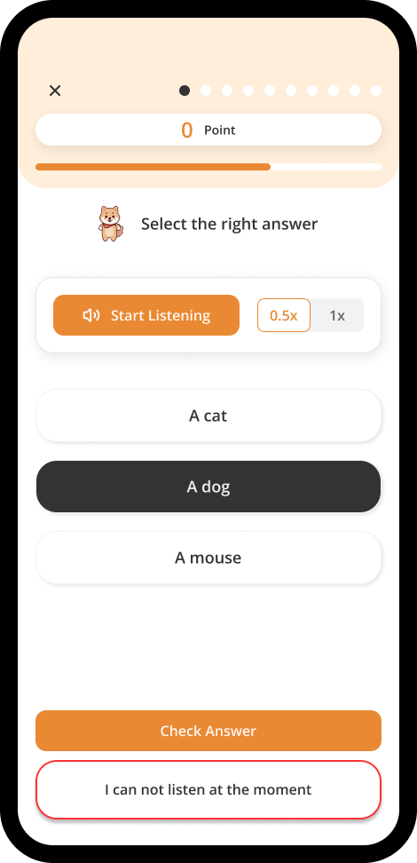
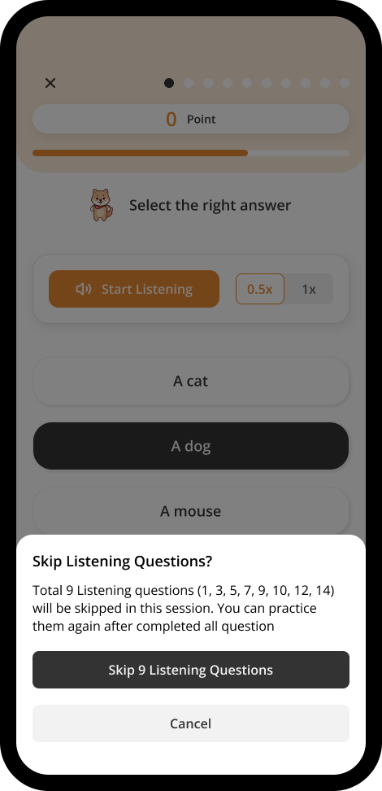
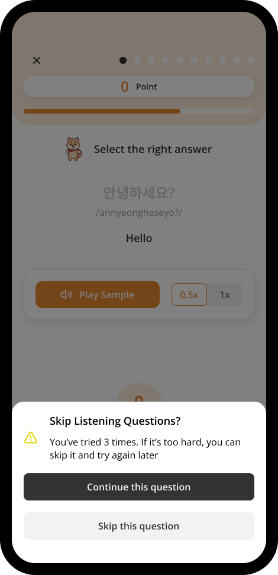

# Skip Question

If you are unable to complete a listening or speaking question due to a difficult circumstance, or if you simply find a question too challenging, you have the option to skip it.

## Skip Listening & Speaking Questions

You can press **I can't listen at the moment** button (for Listening Questions) or **I can't speak at the moment** (for Speaking Questions) to skip **all the listening / speaking questions** in this session.

You can try it again after completed all other questions.

## Skip A Challenging Speaking Question

For every speaking question, you have 3 tries to complete it. If not, you can skip any hard speaking question, and only this **1 question will be skipped**.

