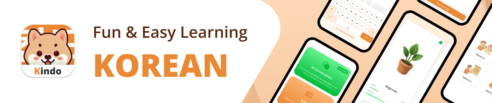

# What is Kindo

**Kindo** is a mobile application designed to help users learn the Korean language through engaging, gamified lessons.

What sets us apart in the market:

- **First-Ever Virtual Keyboard:** We are the first app to feature a built-in Korean virtual keyboard, providing a seamless experience for users to practice writing.
- **A.I. Integration:** Our use of A.I. personalized conversation practice and adapts to each user's level, enhancing the learning experience.

Kindo's Key Features:

- **Gamified Learning:** Kindo transforms language acquisition into an engaging experience with interactive question-and-answer formats, giving learners the flexibility to focus on specific topics of interest.
- **Bilingual Support:** With support for both English and Vietnamese, Kindo allows users to easily switch between languages, catering to a wider audience.
- **Extensive Lesson Library:** The platform provides over 150 lessons (is being updated), organized into three distinct levels, with approximately 50 lessons per level. This structured curriculum is designed to help learners achieve fluency.
- **AI-Powered Practice:** Our AI system offers personalized practice sessions covering all four language skills: listening, reading, writing, and speaking. Each session is followed by a detailed performance review to guide improvement.
- **Incentive Program:** Learners are motivated through a visually appealing badge system. These badges can be collected and shared with friends, fostering a sense of accomplishment and community.
