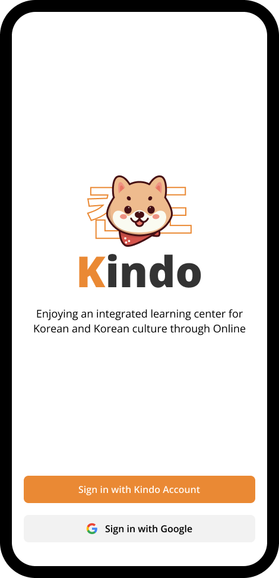
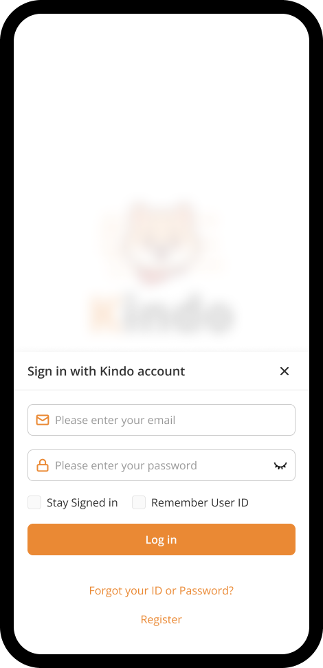
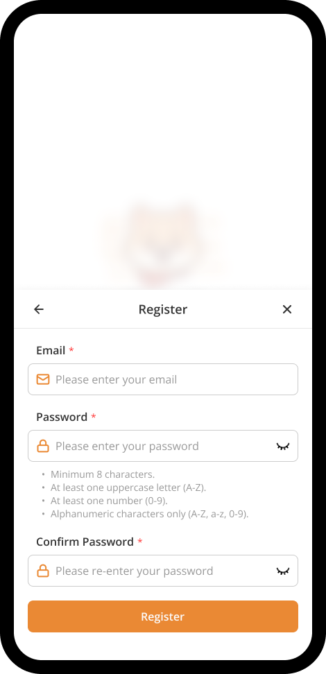
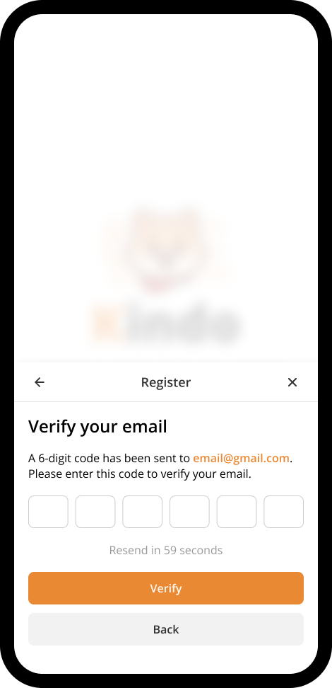
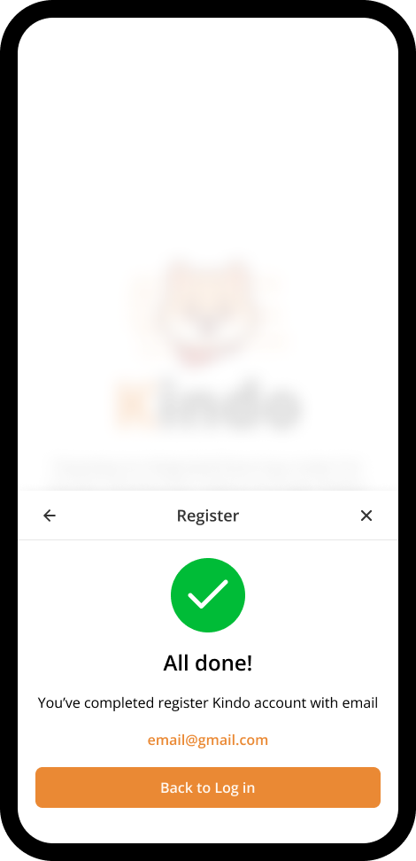

# Sign in

You can sign in to Kindo with your signed up account or sign in with Google account. If you didn't have Kindo account, you can create a new account.

## Create New Account

In sign in screen, click **Sign in with Kindo account**.

A drawer will be opened, then click **Register**.

Fill in every field to create your account, after completed, click **Register**.

An OTP will be sent to your registered email address. Check your inbox for the code. If you don't receive it, kindly check your spam or junk folder. After get the OTP, fill it and then click **Verify**.

All done! You've completed registered Kindo account. Now you can sign in with this acoount.

## Sign in with Google account

You can use your Google account as a quick & simple sign in method to Kindo.
